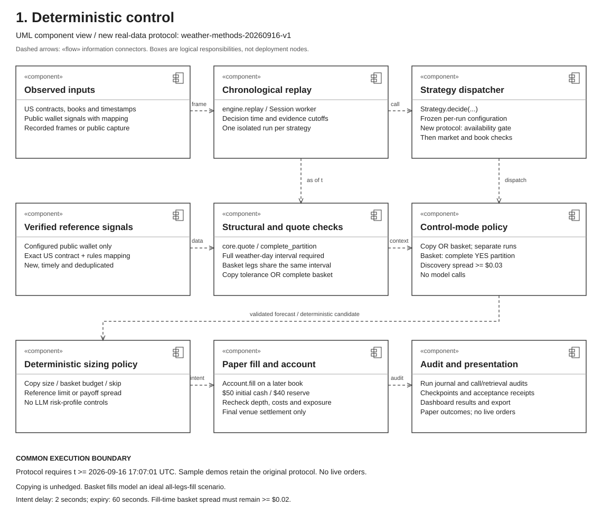
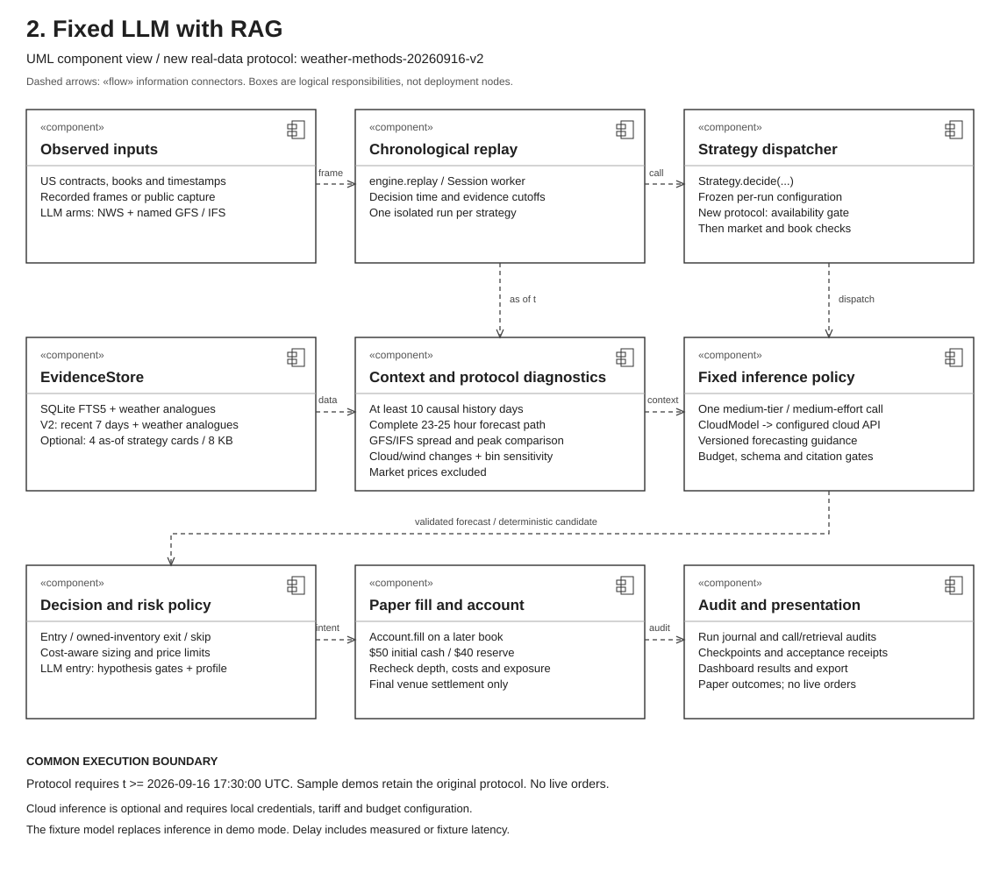
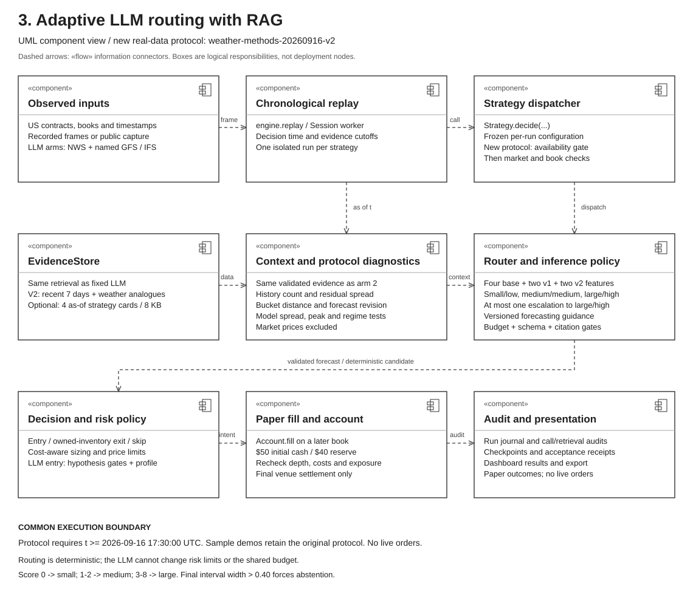
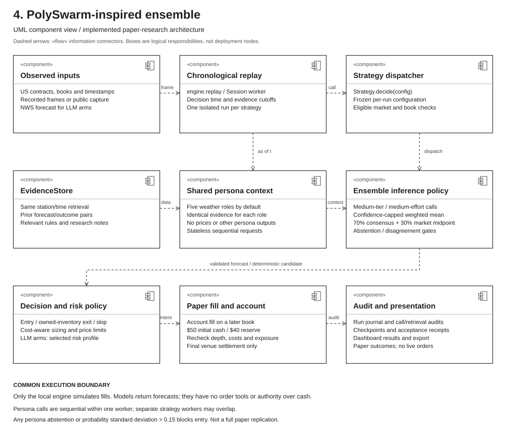
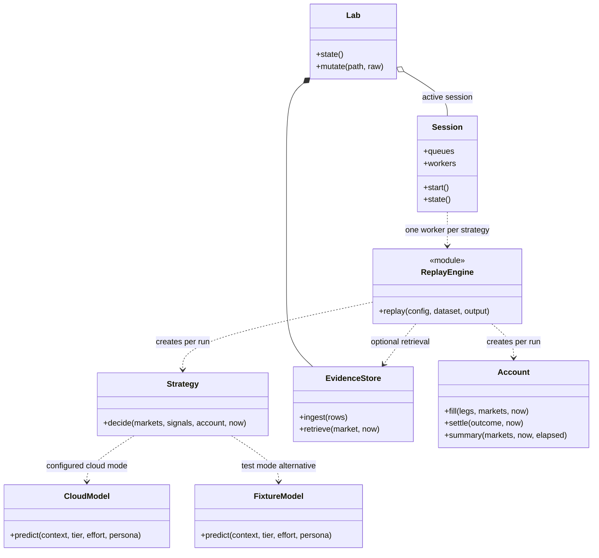
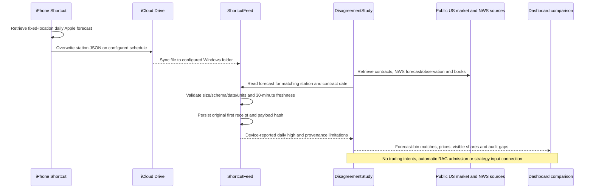

# Weather Lab architecture UML

These diagrams describe the implementation at baseline commit `8259902`, not a proposed production trading system. Each arm uses the same runtime with a different strategy configuration. Component views show logical responsibilities; they do not imply separate processes or one Python class per box. Sequence views show call order and decision branches.

Open the [offline diagram gallery](architecture/index.html) locally, or open the SVG figures below. The Mermaid sequence diagrams also render directly on GitHub. All figures use monochrome, square components and system sans-serif text.

## 1. Deterministic control



**Package:** `01-wallet-control.zip`. Copy and arbitrage are mutually exclusive run configurations. Copying an account is an unhedged benchmark. The basket mode models a complete disjoint temperature partition with ordinary aggregate payout of $1; it assumes all legs fill together in the paper simulator.

```mermaid
sequenceDiagram
    autonumber
    participant E as engine.replay
    participant S as Strategy (wallet_control)
    participant Q as core quote and mapping checks
    participant A as Account (isolated paper ledger)
    participant J as Run journal
    E->>S: decide(markets, signals, account, now)
    alt control_mode = copy
        S->>S: Deduplicate reference-wallet signals
        S->>S: Check start time, freshness, exact US identity and rules
        S->>Q: Size within reserve and exposure limits
        Q-->>S: Quantity and stressed cost
        S->>S: Apply reference price tolerance
    else control_mode = arbitrage
        S->>S: Group by station-day and verify complete partition
        S->>Q: Quote one YES share per bucket with synchronized books
        Q-->>S: Aggregate cost including modeled fees and slippage
        S->>S: Require discovery spread at least 0.03 and sufficient budget
    end
    S-->>E: Intent ready after 2 seconds, expires after 60 seconds; or skip
    E->>J: Record decision or skip
    opt Intent is ready in a later eligible frame
        E->>A: fill(legs, current books, limits)
        A->>Q: Recheck depth, identity, reserve and costs
        Note over A,Q: Basket fill requires every leg and remaining spread of at least 0.02
        A-->>E: Paper fill or rejection
        E->>J: Record result and account checkpoint
    end
    opt Final venue settlement becomes available
        E->>A: settle(verified binary outcome, now)
        E->>J: Record settlement
    end
```

No model calls. Wallet signals require an explicitly reviewed mapping from the international public wallet feed to the exact US contract. An unmatched signal is skipped.

## 2. Fixed LLM with point-in-time RAG



**Package:** `02-fixed-llm.zip`. One configured medium-tier call with medium reasoning effort for each eligible decision. RAG is SQLite FTS5 plus numeric weather analogues; no embedding service or model fine-tuning is implemented.

```mermaid
sequenceDiagram
    autonumber
    participant E as engine.replay
    participant R as EvidenceStore
    participant S as Strategy and core.context
    participant M as CloudModel
    participant L as Shared budget ledger
    participant P as Configured cloud model
    participant A as Account
    E->>R: retrieve(market, decision time)
    R-->>E: Eligible prior station-days, rules, notes and audit IDs
    E->>S: decide with retrieved evidence and current books
    S->>S: Validate forecast, book and at least 10 causal history days
    Note over S,P: Forecast context excludes market prices; no model tool access
    S->>M: predict(context, medium tier, medium effort)
    M->>L: Reserve estimated cost under shared daily cap
    M->>P: Structured probability request
    P-->>M: Probability, bounds, confidence, abstain and evidence IDs
    M->>M: Validate schema, probability bounds and supplied citations
    M->>L: Reconcile known token usage
    M-->>S: Validated prediction, latency and call audit
    S->>S: Apply selected risk profile, exit/entry logic and sizing
    S-->>E: Intent or abstention with audit
    opt Intent ready in a later observed frame
        E->>A: Recheck and simulate fill after max(2 seconds, model latency)
        A-->>E: Fill or rejection
    end
    Note over E,A: Engine journals retrieval, decisions, fills and later settlements
```

Budget/configuration failures stop a model call. Unknown billed usage retains its reservation; the adapter does not automatically retry. Fixture mode substitutes `FixtureModel` and makes no cloud call.

## 3. Adaptive model routing with point-in-time RAG



**Package:** `03-adaptive-llm.zip`. Same evidence, risk policy and fill engine as architecture 2. A deterministic router selects the initial tier; the LLM does not choose its own budget or execution authority.

```mermaid
sequenceDiagram
    autonumber
    participant E as engine.replay
    participant R as EvidenceStore and core.context
    participant S as Strategy
    participant T as route(context)
    participant M as CloudModel and budget gate
    participant P as Configured cloud model
    participant A as Account
    E->>R: Retrieve and validate evidence as of decision time
    R-->>E: Causal context with at least 10 prior station-days
    E->>S: decide(current frame)
    S->>T: Estimate computational effort
    T->>T: Sum four binary complexity features
    T-->>S: Small/low, medium/medium or large/high
    S->>M: predict(context, selected tier, effort)
    M->>P: Budget-reserved structured request
    P-->>M: Prediction and usage
    M-->>S: Validated prediction and audit
    opt Width above 0.30 OR confidence below 0.50, and initial tier is not large
        S->>M: One escalation to large tier, high effort
        M->>P: Second budget-reserved request with the same context
        P-->>M: Replacement prediction
        M-->>S: Validated prediction and second call audit
    end
    S->>S: Force abstention if final width exceeds 0.40
    S->>S: Apply risk profile and common exit/entry sizing
    S-->>E: Intent or skip; include route features and all call audits
    opt Intent ready in a later observed frame
        E->>A: Recheck and fill after max(2 seconds, summed call latency)
        A-->>E: Paper fill or rejection
    end
```

Router score adds one point for each: fewer than 30 history days; residual standard deviation above 3°F; forecast within 2°F of a bucket boundary; absolute forecast revision above 2°F. Score 0 selects small/low; 1–2 medium/medium; 3–4 large/high. This is a fixed heuristic, not a trained router. Maximum two calls per eligible decision.

## 4. PolySwarm-inspired persona ensemble



**Package:** `04-polyswarm.zip`. Five roles by default: meteorologist, historical calibration analyst, settlement auditor, skeptic and weather-regime analyst. These are sequential stateless model requests within one strategy worker, not autonomous spawned agents. The implementation is inspired by the research and is not a full paper replication.

```mermaid
sequenceDiagram
    autonumber
    participant E as engine.replay
    participant R as EvidenceStore and core.context
    participant S as Strategy (polyswarm)
    participant M as CloudModel and budget gate
    participant P as Medium-tier cloud model
    participant G as Consensus aggregation
    participant A as Account
    E->>R: Retrieve and validate evidence at decision time
    R-->>E: Causal context and allowed evidence IDs
    E->>S: decide(current frame)
    loop Each configured persona, sequentially; default count 5
        S->>M: predict(same context, medium tier/effort, persona)
        M->>P: Budget-reserved request; no prices or other persona outputs
        P-->>M: Persona prediction and token usage
        M-->>S: Validated prediction and audit
    end
    S->>G: Aggregate persona predictions and external market midpoint
    alt Any persona abstains
        G-->>S: Abstain
    else All personas return forecasts
        G->>G: Weight each probability by confidence clipped to 0.10–0.80
        G->>G: Blend 70% consensus with 30% market midpoint
        G->>G: Envelope bounds and union evidence IDs
        G->>G: Abstain if persona probability standard deviation exceeds 0.15
        G-->>S: Aggregate probability, bounds and confidence
    end
    S->>S: Apply risk profile and shared sizing/exit policy
    S-->>E: Intent or abstention, all persona audits and total latency
    opt Intent ready in a later observed frame
        E->>A: Recheck and fill after max(2 seconds, summed call latency)
        A-->>E: Paper fill or rejection
    end
```

Persona count is configurable from 3 to 50, with the five role prompts cycling. Confidence weights are uncalibrated, and model errors may be correlated. A request failure prevents completion of the decision; partial ensembles are not silently substituted.

## Shared runtime and boundaries



- **Control plane:** browser → loopback HTTP/CSRF checks → `Lab` → validated ZIP configuration → `Session` or offline `replay`. ZIP uploads register declarative configurations; uploaded Python is not executed.
- **Data plane:** public capture or recorded frames → chronological replay → strategy → delayed intent → observed-depth paper fill → settlement → immutable run artifacts. Four session workers have independent accounts and size-one input queues; a slow worker can drop frames. Public frames are stamped no earlier than processing time. Common publication therefore does not guarantee identical consumed frames; compare logged receipts and dropped-frame counts in research results.
- **Risk:** $50 starting capital; $40 protected cash; $5 common position/station-day ceilings; five-share proposal cap. LLM Reliable/Balanced/Risky settings affect next-run confidence, uncertainty, edge and fractional-Kelly rules. Reliable uses a tighter $2 event cap. All fills recheck hard limits. $200/month overhead is reported separately for each alternative; model cost is additional.
- **Causality:** RAG filters publication, receipt and availability timestamps at the decision time and uses prior-day completed history. Settlements cannot enter a prediction before availability. These controls constrain supplied data; they cannot prove that an LLM's pretrained weights lack historical outcome knowledge.
- **Persistence:** evidence SQLite index, shared model-budget SQLite ledger, independent hash-chained run journals, input/config/code hashes, checkpoints and acceptance receipts. Checkpoints support inspection; automatic crash resume is not implemented.
- **Deployment:** all orchestration and paper accounting run on the PC. Only configured inference requests go to the cloud API. Small/medium/large are configuration tiers; exact provider model IDs and returned IDs belong in the run audit. Diagrams do not assert API availability or successful paid inference.

## Apple Weather study: separate implemented pipeline



The phone/iCloud path still requires user setup and end-to-end device verification. WeatherKit remains an optional CLI source. Station coordinates and weather-day equivalence are unverified for Shortcuts exports. This side pipeline must not be drawn as an active input to the four strategies until a reviewed integration exists. NWS final daily highs are scored separately after the day; a current observation is not that outcome.

## Source map

| Responsibility | Implementation |
| --- | --- |
| Dashboard, ZIP registration, session dispatch | `web/app.js`, `weatherlab/server.py`, `weatherlab/packages.py` |
| Public sources and frame publication | `weatherlab/sources.py`, `weatherlab/session.py` |
| Causal replay, journals, delayed intents | `weatherlab/engine.py` |
| Four decision policies, router, aggregation, profiles | `weatherlab/strategies.py` |
| Context validation, quotes, fills, paper account | `weatherlab/core.py` |
| RAG and immutable evidence | `weatherlab/rag.py` |
| Model adapter, persona prompts, cost reservation | `weatherlab/models.py` |
| Apple/NWS side study | `weatherlab/shortcut_feed.py`, `weatherlab/disagreement.py` |

Figures are generated by `python docs/architecture/render.py`; this uses only the Python standard library. SVGs and the HTML gallery work offline. Mermaid source is embedded above for editing on GitHub or in a compatible diagram editor.
