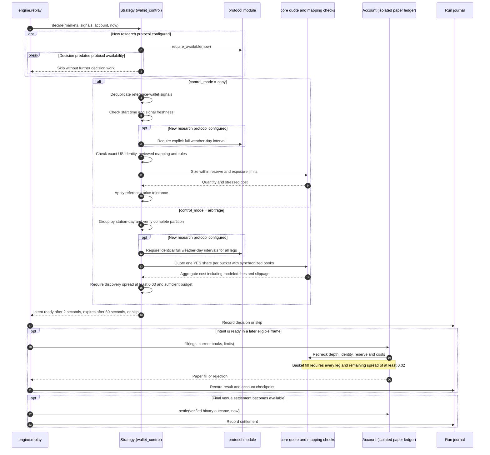
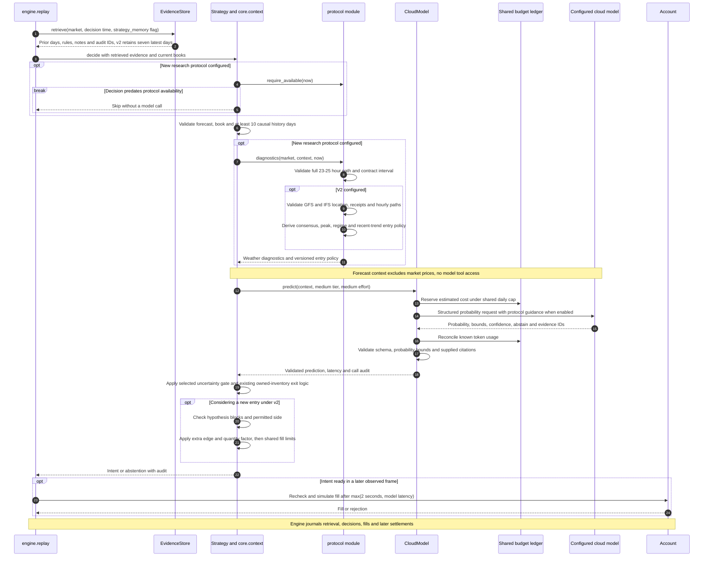
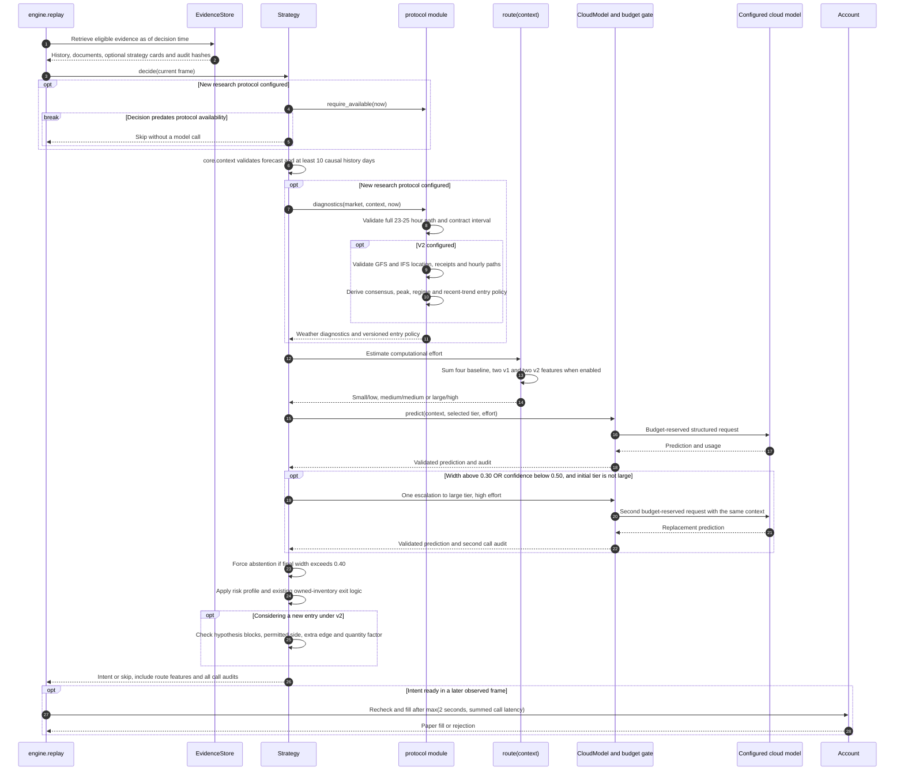
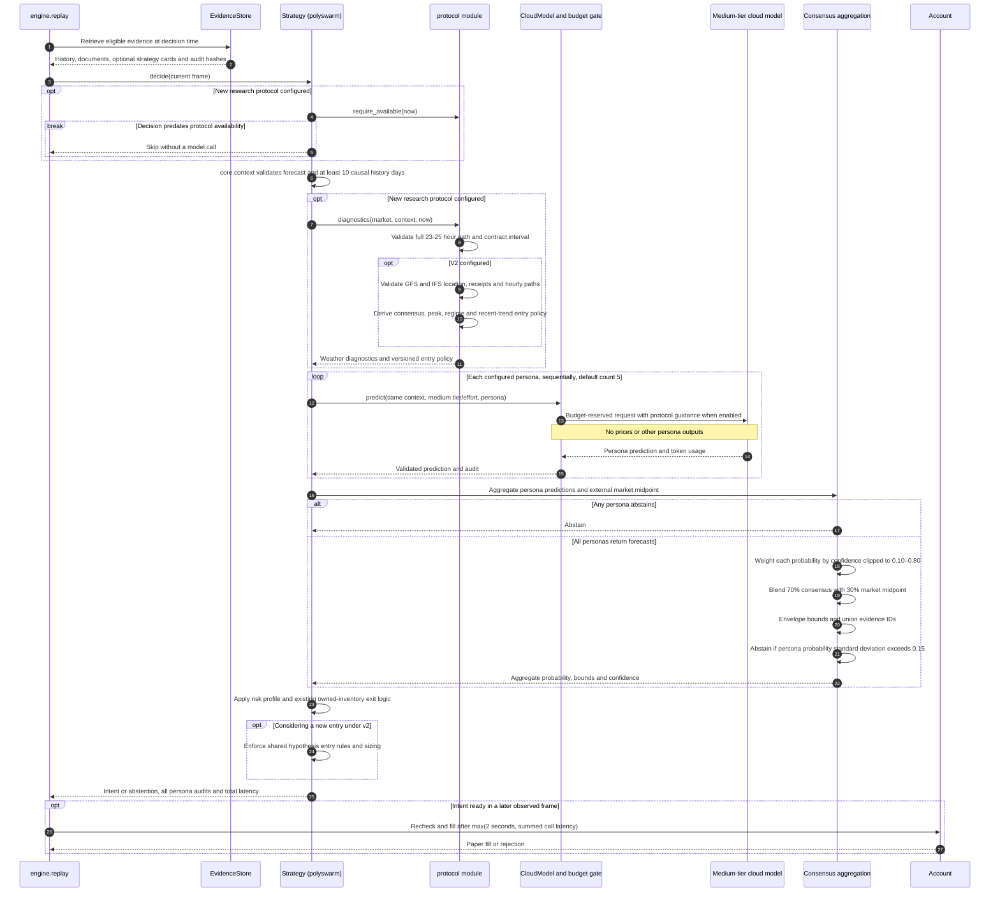
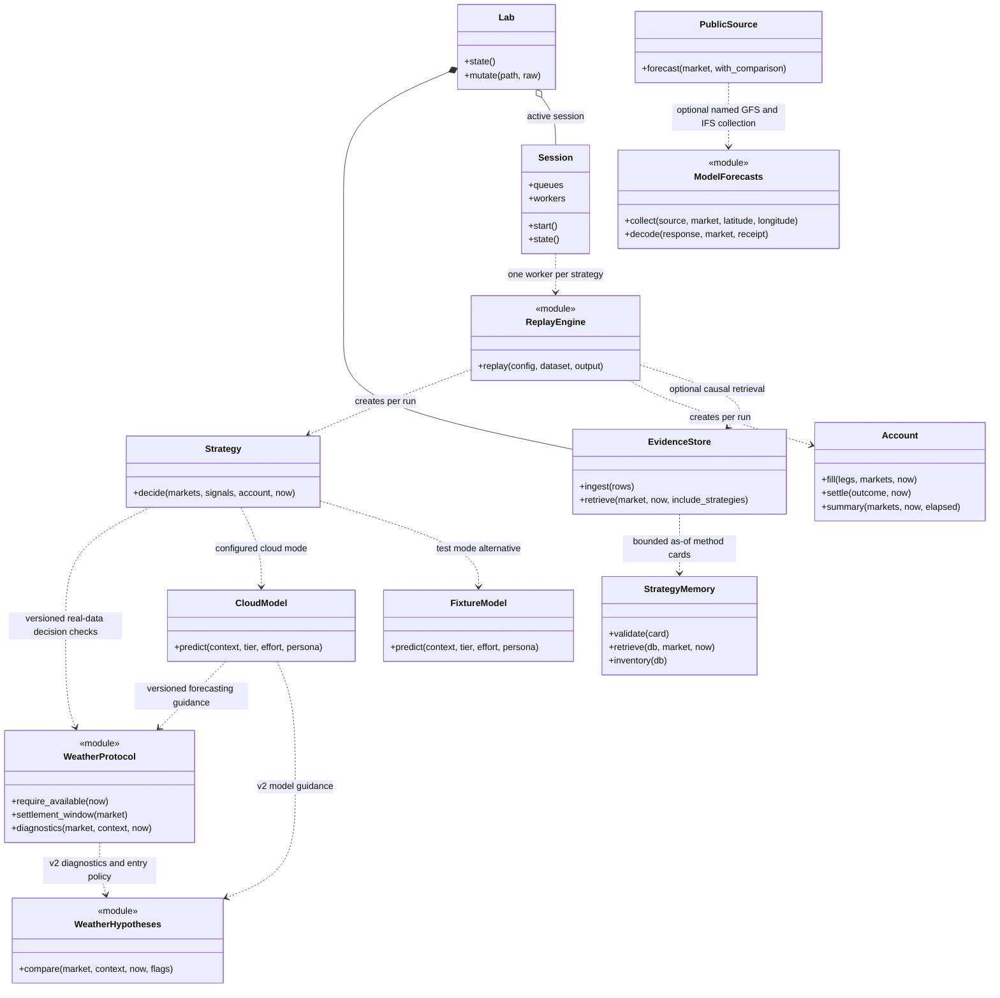
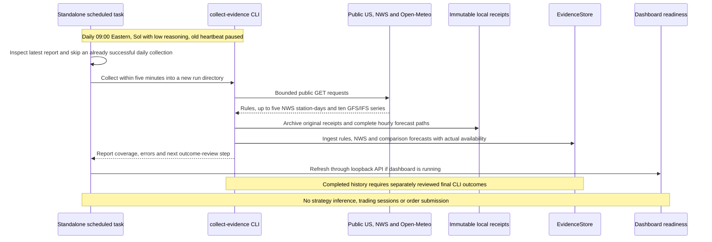
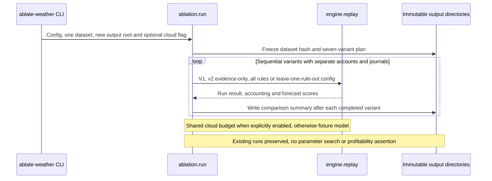
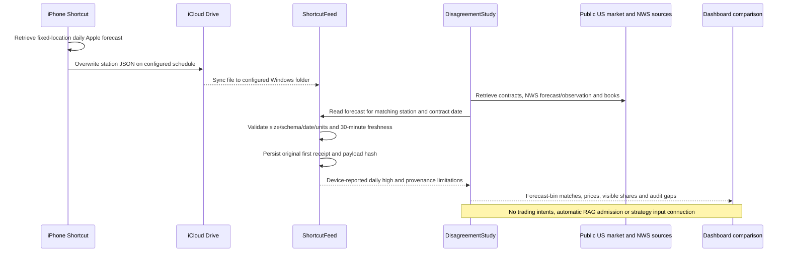

# Weather Lab architecture UML

These diagrams describe the implemented `weather-methods-20260916-v2` architecture. V1 and original protocol branches remain supported. The containing Git revision identifies the exact implementation. Each arm uses the same runtime with a different strategy configuration. Component views show logical responsibilities; they do not imply separate processes or one Python class per box. Sequence views show call order and decision branches.

Open the [offline diagram gallery](architecture/index.html) locally, or open the SVG figures below. The Mermaid sequence diagrams also render directly on GitHub. All figures use monochrome, square components and system sans-serif text.

The new protocol applies to newly packaged real-data runs. Earlier configurations and synthetic demos retain the original protocol. Its v2 availability gate rejects decisions before September 16, 2026 at 17:30:00 UTC (v1 retains 17:07:01 UTC). Validation failures return a skip before inference or intent creation. See the [v2 hypotheses and separate setup steps](WEATHER-HYPOTHESES.md), and the [original method review](WEATHER-METHODS-REVIEW.md).

## 1. Deterministic control


**Package:** `01-wallet-control.zip`. Copy and arbitrage are mutually exclusive run configurations. Copying an account is an unhedged benchmark. The basket mode models a complete disjoint temperature partition with ordinary aggregate payout of $1; it assumes all legs fill together in the paper simulator.



No model calls. Wallet signals require an explicitly reviewed mapping from the international public wallet feed to the exact US contract. An unmatched signal is skipped.

## 2. Fixed LLM with point-in-time RAG


**Package:** `02-fixed-llm.zip`. One configured medium-tier call with medium reasoning effort for each eligible decision. RAG is SQLite FTS5 plus numeric weather analogues; no embedding service or model fine-tuning is implemented.



Budget/configuration failures stop a model call. Unknown billed usage retains its reservation; the adapter does not automatically retry. Fixture mode substitutes `FixtureModel` and makes no cloud call.

## 3. Adaptive model routing with point-in-time RAG


**Package:** `03-adaptive-llm.zip`. Same evidence, risk policy and fill engine as architecture 2. A deterministic router selects the initial tier; the LLM does not choose its own budget or execution authority.



Router score adds one point for each: fewer than 30 history days; residual standard deviation above 3°F; forecast within 2°F of a bucket boundary; absolute forecast revision above 2°F. V1 adds one point for a half-degree probability span above 0.15 and one for a largest hourly temperature change above 3°F. V2 adds one point for model spread above 3°F or peak-window distance above 3 hours, and one for a detected regime change. Score 0 selects small/low; 1–2 medium/medium; any score at least 3 selects large/high (maximum 4 originally, 6 in v1 and 8 in v2). This is a fixed heuristic, not a trained router. Maximum two calls per eligible decision.

## 4. PolySwarm-inspired persona ensemble


**Package:** `04-polyswarm.zip`. Five roles by default: meteorologist, historical calibration analyst, settlement auditor, skeptic and weather-regime analyst. These are sequential stateless model requests within one strategy worker, not autonomous spawned agents. The implementation is inspired by the research and is not a full paper replication.



Persona count is configurable from 3 to 50, with the five role prompts cycling. Confidence weights are uncalibrated, and model errors may be correlated. A request failure prevents completion of the decision; partial ensembles are not silently substituted.

## Shared runtime and boundaries



- **Control plane:** browser → loopback HTTP/CSRF checks → `Lab` → validated ZIP configuration → `Session` or offline `replay`. ZIP uploads register declarative configurations; uploaded Python is not executed.
- **Data plane:** public capture or recorded frames → chronological replay → strategy → delayed intent → observed-depth paper fill → settlement → immutable run artifacts. Four session workers have independent accounts and size-one input queues; a slow worker can drop frames. Public frames are stamped no earlier than processing time. Common publication therefore does not guarantee identical consumed frames; compare logged receipts and dropped-frame counts in research results.
- **Risk:** $50 starting capital; $40 protected cash; $5 common position/station-day ceilings; five-share proposal cap. LLM Reliable/Balanced/Risky settings affect next-run confidence, uncertainty, edge and fractional-Kelly rules. Reliable uses a tighter $2 event cap. All fills recheck hard limits. $200/month overhead is reported separately for each alternative; model cost is additional.
- **Causality:** RAG filters publication, receipt and availability timestamps at the decision time and uses prior-day completed history. Settlements cannot enter a prediction before availability. These controls constrain supplied data; they cannot prove that an LLM's pretrained weights lack historical outcome knowledge.
- **Protocol:** new real-data package configurations freeze the research version. The control validates full-day settlement intervals without a forecast or LLM. LLM arms require a complete hourly path, add bounded diagnostics to context and audits, and receive versioned model guidance. V2 validates named GFS/IFS forecasts, exposes cloud/wind and peak diagnostics, and enforces switchable entry rules after existing exit logic. The two model families are not assumed statistically independent. Sample/demo entry points explicitly remove this protocol and record the original configuration.
- **Persistence:** evidence SQLite index, shared model-budget SQLite ledger, independent hash-chained run journals, input/config/code hashes, checkpoints and acceptance receipts. Checkpoints support inspection; automatic crash resume is not implemented.
- **Deployment:** all orchestration and paper accounting run on the PC. Only configured inference requests go to the cloud API. Small/medium/large are configuration tiers; exact provider model IDs and returned IDs belong in the run audit. Diagrams do not assert API availability or successful paid inference.

## Recurring evidence collection



Reviewed methodology notes are a separate, timestamped `research_note` input. They never count as completed weather history. The scheduled task runs in the Weather Lab deployment and is separate from the older SupahTrade trading experiment.

## Offline hypothesis ablation



Ablations retain v2 evidence/routing when an entry switch is disabled. They compare entry rules, not a full decomposition of each model's reasoning. A failed variant stops the sequence with partial results saved. See [WEATHER-HYPOTHESES.md](WEATHER-HYPOTHESES.md).

## Apple Weather study: separate implemented pipeline



The phone/iCloud path still requires user setup and end-to-end device verification. WeatherKit remains an optional CLI source. Station coordinates and weather-day equivalence are unverified for Shortcuts exports. This side pipeline must not be drawn as an active input to the four strategies until a reviewed integration exists. NWS final daily highs are scored separately after the day; a current observation is not that outcome.

## Strategy memory

New forecasting package configurations enable `strategy_memory: true`. Original configurations default to false; the control never consumes strategy cards. Synthetic demos and weather-hypothesis ablations explicitly disable memory. The evidence ledger stores immutable `strategy_card` revisions. Retrieval selects the latest revision available at decision time before applying retirement, expiry, station, source and synthetic filters. It adds at most four cards / 8 KB to the existing weather context, records their payload hashes, and excludes monetary evaluation results from probability prompts. Ranking uses applicability and deterministic station-day rotation, not returns. `CloudModel` adds guidance that cards are untrusted references and cannot authorize execution. No embedding service, executable strategy loading, automatic promotion or model training was added. Each changed run still uses a new journal database. See [STRATEGY-MEMORY.md](STRATEGY-MEMORY.md).

## Recent archive benchmark: separate weather-only pipeline

```mermaid
sequenceDiagram
    participant C as historical_window CLI
    participant I as IEM MOS and NWS CLI archives
    participant F as Immutable corpus and receipts
    participant B as Historical benchmark
    participant M as CloudModel or statistical baseline
    participant D as Dashboard recent-history summary
    C->>F: Freeze station, test dates and earlier calibration dates
    C->>I: Bounded public reads for forecasts and raw CLI text
    I-->>C: Archived forecasts, daily highs and publication metadata
    C->>C: Verify station, date, sample coverage and raw observed maximum
    C->>F: Hash calibration, cases and separate labels; preserve receipt times
    Note over C,F: Assumed six-hour forecast availability; never backdate live RAG
    B->>F: Verify hashes and nonoverlapping calibration/test periods
    Note over F,B: Strict replay blocked unless historical availability is verified
    loop At most 31 test days; explicit exploratory override when needed
        B->>B: Filter calibration by outcome publication; redact station/date
        B->>M: Label-free context and bounded inference deadline
        alt Valid forecast
            M-->>B: Probability and call audit
        else Billing, auth, rate, budget or deadline failure
            M-->>B: Sanitized failure; retain uncertain budget reservation
            B->>B: Skip further cloud requests in this benchmark
        end
        B->>F: Append prediction or skip and hash-chain audit
    end
    B->>F: Only now open test labels and write Brier scores
    F-->>D: Local aggregate report with coverage, scores and cloud blocker
    Note over B,D: No historical books, wallet trades, full market blend or profit claim
```

The recent-window downloader is separate from the original August fixture downloader. Both use the bounded historical runner. Archives remain outside the live evidence index. The September 6–15 pilot contains five stations and keeps calibration in August 6–September 5. Its current cloud attempt is blocked by provider credits; the statistical baseline completed. See [RECENT-HISTORY.md](RECENT-HISTORY.md) for reproducible commands, evidence paths and limits.

## Source map

| Responsibility | Implementation |
| --- | --- |
| Dashboard, ZIP registration, session dispatch | `web/app.js`, `weatherlab/server.py`, `weatherlab/packages.py` |
| Public sources and frame publication | `weatherlab/sources.py`, `weatherlab/session.py` |
| Causal replay, journals, delayed intents | `weatherlab/engine.py` |
| Four decision policies, router, aggregation, profiles | `weatherlab/strategies.py` |
| Context validation, quotes, fills, paper account | `weatherlab/core.py` |
| Protocol availability, settlement intervals, hourly diagnostics and model guidance | `weatherlab/protocol.py` |
| Evidence collection and outcome pairing | `weatherlab/research.py`, `weatherlab/sources.py` |
| Named GFS/IFS collection and validation | `weatherlab/weather_models.py` |
| Weather features, switchable entry policies and ablations | `weatherlab/hypotheses.py`, `weatherlab/ablation.py` |
| RAG and immutable evidence | `weatherlab/rag.py` |
| Strategy reference validation, selection, seed library and inventory | `weatherlab/strategy_memory.py` |
| Model adapter, persona prompts, cost reservation | `weatherlab/models.py` |
| Recent archive download, raw CLI checks and weather-only benchmark | `weatherlab/historical_window.py`, `weatherlab/historical.py` |
| Apple/NWS side study | `weatherlab/shortcut_feed.py`, `weatherlab/disagreement.py` |

Figures are generated by `python docs/architecture/render.py`; this uses only the Python standard library. SVGs and the HTML gallery work offline. Mermaid source is embedded above for editing on GitHub or in a compatible diagram editor.

## Maintenance rule

Architecture changes must update this document and `docs/architecture/render.py` in the same change. Regenerate the four SVGs and offline gallery, verify diagram rendering and call order against the implementation, and rebuild the distributable ZIPs. State whether a connection is implemented, optional, or still unconnected. Keep the original protocol and new protocol branches explicit.
