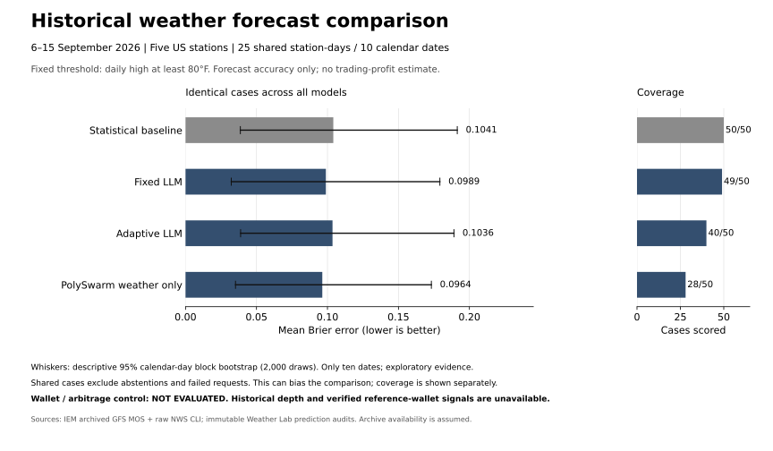
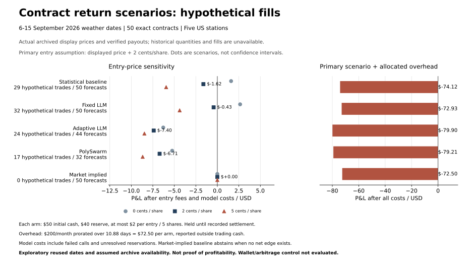

# Recent weather benchmark

## Funded cloud run: completed September 16, 2026



[PNG](results/historical-comparison.png) · [PDF](results/historical-comparison.pdf) · [Comparison JSON](results/historical-comparison.json) · [Market coverage and joins](results/market-input-coverage.json)

The funded run processed all five stations and produced **333 validated model responses**: 291 Terra, 32 Luna and 10 Sol. All three configured model tiers returned validated responses. Outputs are preserved separately under `cloud-funded-STATION-v1/`; the earlier billing-failed run remains unchanged.

| Model | Scored / 50 | Brier on 25 shared cases | Shared-case accuracy |
| --- | ---: | ---: | ---: |
| Statistical baseline | 50 / 50 | 0.104114 | 88% |
| Fixed LLM | 49 / 50 | 0.098880 | 88% |
| Adaptive LLM | 40 / 50 | 0.103555 | 88% |
| PolySwarm weather only | 28 / 50 | 0.096359 | 88% |

PolySwarm has the smallest observed Brier error on this selected shared-case subset. The intervals overlap substantially and every model has 22/25 correct directional classifications. This does not establish a reliable winner or a profitable strategy. The baseline's full 50-case Brier is 0.109173; comparisons to an arm's different successful subset are not a fair ranking.

Fixed LLM skipped one case through abstention. Adaptive LLM had ten failed validation/response cases. The swarm skipped 16 cases through persona abstention, four through validation/response failures and two through timeouts. Generic `ValueError` diagnostics do not establish the precise provider/validation cause; no favorable replacement predictions were substituted. Each swarm prediction required all five personas. The 25-case intersection excludes those failures and can introduce selection bias.

Validated responses have a token-priced estimate of **$4.459422** under the configured tariffs. Run accounting, including known failed-call usage and conservative unresolved reservations, totals **$4.630867**. These are application estimates, not an invoice. Prior billing-failed reservations are separate. The existing shared $20 UTC-day cap was retained.

The graph uses all ten calendar dates. The runs read outcomes only after committing their predictions and retain the same earlier calibration; no model configuration or prompt was tuned on these outcomes. Stations ran in separate bounded Python processes sharing the budget ledger. No retrospective archive record was backdated into live RAG, and no actual orders were placed.

## Completed collection and results

On September 16, 2026, the local collector downloaded September 6–15 forecasts and final daily highs for KLAX, KMDW, KMIA, KNYC and KSFO: **50 test station-days**, plus **155 earlier calibration station-days** (August 6–September 5). All five final station manifests report zero collection errors. A station-day is one station on one date.

This is an exploratory weather accuracy benchmark. It does not establish trading profitability or reproduce the full four-strategy trading comparison.

| Station | Test days | Days at least 80°F | Baseline mean Brier score |
| --- | ---: | ---: | ---: |
| KLAX — Los Angeles | 10 | 8 | 0.163237 |
| KMDW — Chicago Midway | 10 | 6 | 0.123494 |
| KMIA — Miami | 10 | 10 | 0.000246 |
| KNYC — Central Park | 10 | 3 | 0.079738 |
| KSFO — San Francisco | 10 | 4 | 0.179152 |

Brier score measures squared probability error; lower is better. Miami's ten outcomes are all YES at the fixed 80°F threshold, so its low score is not evidence that this station or strategy is superior. Ten days per station is too small for a profitability or generalization claim. No threshold was optimized on this test set.

## Sources and timing

- [IEM GFS MOS archive API](https://mesonet.agron.iastate.edu/api/1/mos.json): prior-day 12Z GFS MOS, using eight three-hour temperature samples over each station's local-standard CLI day. This sampled maximum is a different product from the live NWS hourly-grid forecast and may miss the true forecast peak.
- [IEM NWS CLI archive](https://mesonet.agron.iastate.edu/json/cli.py?station=KLAX&year=2026): final daily highs. Every included outcome was cross-checked against archived raw NWS CLI text for station, product, target date, Fahrenheit units and observed maximum. The collector accepts the `R` record-temperature marker.
- Each receipt retains its source URL, actual download time and content hash. Forecast availability uses an **assumed six-hour dissemination lag**, not a verified historical first-seen timestamp. Strict historical replay therefore remains blocked; exploratory runs require `--allow-assumed-availability`.

Earlier calibration outcomes are admitted only if their publication precedes that case's decision time. Test labels remain in a separate file and are opened for scoring only after all predictions have been written. Prompts redact station and date, but this cannot rule out pretrained model knowledge. Harness development used historical diagnostics; a fresh held-out period is necessary for confirmatory research.

These archive records are **not added to live RAG as causal history** and do not unlock its ten-day readiness requirement. Today's download timestamp cannot prove that a forecast was available to a live agent ten days ago. The benchmark excludes present-day strategy cards, unavailable historical books and wallet signals. The control cannot be scored without those market inputs. PolySwarm cloud mode is a weather-persona ablation, without its market-price blend or the full trading pipeline.

## Initial cloud attempt (before credits were added)

Cloud inference is enabled locally with the existing $20/day application cap. The attempted KLAX cloud benchmark produced **zero validated model responses**. The provider returned **HTTP 429 / `credit_balance_exhausted`**. Thirty benchmark requests and one diagnostic request were attempted before the billing cause was identified. The updated runner stops further benchmark requests after the first billing, authentication, rate-limit, budget or deadline block.

The benchmark ledger retained $1.0486652 in conservative reservations; the diagnostic has a separate reservation. **Reservations are not confirmed charges.** They remain because failed requests provide no reliable usage reconciliation.

This initial attempt required funding the API account associated with the configured key. The user subsequently added credits and authorized a fresh run. No credits were purchased, no account was created, and no real orders were submitted. Model-list access alone does not validate inference. After funding, rerun into a new output directory; do not overwrite previous evidence. Historical contract books, public-wallet signals and reviewed exact US contract rules are still needed for a trading backtest.

## Local evidence

The ignored local archive root is `data/historical/2026-09-06_2026-09-15-v2/`. Each station directory contains `protocol.json`, `manifest.json`, `training.jsonl`, `cases.jsonl`, `labels.jsonl` and original receipts. Baseline results are in `baseline-KLAX/` through `baseline-KSFO/`; the failed cloud run is preserved in `cloud-KLAX/`. Aggregate files are `collection-summary.json`, `baseline-summary.json` and `report.json`. The dashboard reads `data/historical/latest-recent.json`.

Raw downloaded data and local budget/account state are excluded from the public repository and ZIPs. Earlier unsuccessful collection attempts remain separate and immutable.

## Reproduce or extend

From the Weather Lab deployment folder, choose new output directories for every run:

```powershell
python -m weatherlab.historical_window --station KLAX --start 2026-09-06 --end 2026-09-15 --out data/historical/new-klax-corpus
python -m weatherlab.historical run --corpus data/historical/new-klax-corpus --out data/historical/new-klax-baseline --mode baseline --allow-assumed-availability
```

After resolving API credits, a bounded cloud run uses the same existing shared daily budget:

```powershell
python -m weatherlab.historical run --corpus data/historical/2026-09-06_2026-09-15-v2/KLAX --out data/historical/new-klax-cloud --mode cloud --allow-assumed-availability --max-seconds 900
```

Supported station IDs: `KLAX`, `KMDW`, `KMIA`, `KNYC`, `KSFO`. Collection accepts 1–31 completed test dates with 31 preceding calibration dates. Reads, row counts, memory buffers and inference runtime are bounded; replay does not sleep to simulate elapsed historical time. Reported Python peak memory does not measure all native-process memory.


## Supplemental Polymarket US market inputs

A separate public archive collected 300 contracts for September 6–15, 4,499 historical display-price observations and 300 binary USD settlements, with zero collection errors. Of those prices, 2,083 precede the contract weather-day start. At least one price exists at or before the benchmark decision for 299 contracts. All 300 exact weather-day intervals and venue payouts matched the station/date CLI outcomes. Only three contracts exactly match this pilot's fixed >=80°F question; the other temperature buckets must not be substituted.

The [public price-history API](https://docs.polymarket.us/api-reference/price-history/get-price-history) returns book-derived displayed YES/NO prices, normally the YES ask and one minus the YES bid. The one-month profile samples every three hours. It does not provide quantities or individual executions. Closed-book receipts supply settlement prices and publication timestamps. None of this is a historical depth reconstruction. The [institutional report API](https://docs.polymarket.us/institutional/report/overview) requires separate Auth0 report credentials (and participant identity for trade/order searches). The saved retail account key is not evidence of institutional access. No reference-wallet ID is configured.

Local receipts and hashes are in `data/historical/market-inputs-20260916-v2/`. `weather-join-audit.json` records the station/date/interval/bucket checks. Current metadata lacks verified historical first-seen rules. These records are supplemental research inputs and remain separate from the frozen weather prompts and live RAG. They do not unlock trade execution or establish trading returns.

To collect another immutable archive:

```powershell
python -m weatherlab.historical_market --start 2026-09-06 --end 2026-09-15 --out data/historical/new-market-archive
```

## Comparison graph methodology

The dashboard graph compares Brier error on the intersection of cases successfully scored by the baseline and all three cloud arms. The coverage table also shows every arm's total scored cases out of 50. Classification accuracy predicts YES when probability is at least 0.5 and uses the same shared cases as the graph. Selection bias remains because shared-case filtering excludes abstentions and failed requests. PolySwarm here means its weather-persona ablation, not the full market-price blend. The deterministic copy/arbitrage control is explicitly unscored.

Intervals are descriptive 95% calendar-day block bootstrap intervals (2,000 draws, fixed seed 20260916), retaining same-day dependence across stations. Ten dates are insufficient for a strong statistical or profitability claim. Do not rank strategies on differing all-case subsets or interpret classification accuracy as returns.

`weatherlab.historical_report` verifies completed prediction hash chains and builds the shared comparison JSON. The dashboard and optional Matplotlib export use those same values. Export dependencies were installed only into ignored `data/tools/plotting`; the core and dashboard still use the standard library and browser APIs.

```powershell
python -m weatherlab.historical_report --root data/historical/2026-09-06_2026-09-15-v2 --prefix cloud-funded- --suffix=-v1 --out data/historical/new-comparison.json
python -m pip install --no-user --target data/tools/plotting --only-binary=:all: -r tools/plotting-requirements.txt
$env:PYTHONPATH = "$PWD/data/tools/plotting"
python tools/plot_historical.py --input data/historical/new-comparison.json --out docs/results/historical-comparison
```

## Contract return scenarios

This follow-up adds actual US contract ranges, stored minute-level price windows, verified venue payouts and the applicable dated fee schedule to a new cloud run. It is an exploratory **hypothetical full-fill return scenario**, not a verified execution backtest. The previously inspected September 6-15 dates are reused; this is not an untouched holdout.

### Completed rerun results



[PNG](results/contract-returns.png) | [Full results and hypothetical trade ledger](results/contract-returns.json)

The completed run produced **353 validated responses** across 50 exact contracts. No actual orders were placed. Primary scenario: delayed display price plus 2 cents per share.

| Method | Forecasts / 50 | Hypothetical trades | Win rate | Trading P&L after fees | Model cost / reserve | P&L after models | Net including overhead |
| --- | ---: | ---: | ---: | ---: | ---: | ---: | ---: |
| Statistical baseline | 50 | 29 | 48.3% | $-1.62 | $0.00 | $-1.62 | $-74.12 |
| Fixed LLM | 50 | 32 | 50.0% | $0.34 | $0.77 | $-0.43 | $-72.93 |
| Adaptive LLM | 44 | 24 | 41.7% | $-4.89 | $2.51 | $-7.40 | $-79.90 |
| PolySwarm | 32 | 17 | 47.1% | $-3.00 | $3.71 | $-6.71 | $-79.21 |
| Market implied | 50 | 0 | No trades | $0.00 | $0.00 | $0.00 | $-72.50 |

Overhead is **$72.50 per alternative**, prorated over **10.88 days** from first decision through last venue settlement. Total new run model usage/reservations: **$6.9876**. The old weather-only run's cost is not charged a second time to these scenarios.

Trade win rate counts positive realized hypothetical trade P&L after entry fees; its denominator excludes no-trade decisions. It is different from the earlier 80F forecast-classification accuracy. Coverage includes every attempted station-day; failures and abstentions remain no-trade cases and their costs are retained. No model configuration was retuned or favorable replacement prediction selected during this run.

All five forecasting methods share **29 successfully scored cases**. Their comparable exact-contract Brier errors are: Statistical baseline 0.1927; Fixed LLM 0.1960; Adaptive LLM 0.1903; PolySwarm 0.1672; Market implied 0.1441. Lower is better. This selected subset is subject to failure/abstention bias.

**Observed result under the primary assumptions:** none of the active methods remained profitable after model costs. Fixed LLM was closest to break-even ($0.34 trading P&L, -$0.43 after model costs). The market-implied baseline had lower Brier error than every forecasting model on the 29 shared cases. This pilot therefore supplies no evidence that the LLMs added a profitable edge over market prices.

#### Entry-price sensitivity

P&L below includes entry fees and model costs/reservations, but excludes the common overhead allocation. Scenarios reuse the original side-selection signals; position quantities and reserve constraints are recalculated at each assumed entry price. These scenarios are not statistical intervals.

| Method | +0 cents/share | +2 cents/share | +5 cents/share |
| --- | ---: | ---: | ---: |
| Statistical baseline | $1.60 | $-1.62 | $-5.95 |
| Fixed LLM | $2.65 | $-0.43 | $-4.38 |
| Adaptive LLM | $-6.29 | $-7.40 | $-8.48 |
| PolySwarm | $-5.25 | $-6.71 | $-8.68 |
| Market implied | $0.00 | $0.00 | $0.00 |

#### Model coverage failures

- Adaptive LLM: 6 x Cloud call failed (ValueError); budget reservation retained if usage unknown.
- PolySwarm: 7 x Model abstained; 5 x Cloud call failed (ValueError); budget reservation retained if usage unknown; 6 x Cloud call failed (TimeoutError); budget reservation retained if usage unknown.

A generic provider `ValueError` does not identify the exact schema, citation or incomplete-response cause. No successful partial swarm replaces a failed five-persona decision.

**Interpretation:** these are conditional return calculations under assumed fills. The same ten dates were already inspected, the capital constraint is small, and historical depth/first-seen data remain absent. Neither a positive point estimate nor a higher trade win rate establishes deployable profitability. No annualized performance or significance claim is made.

### Frozen protocol

- Select exactly one of the six temperature bins for each station-day: the bin containing the unadjusted archived MOS high. Selection uses neither prices nor test outcomes. All 50 station-days have eligible price windows. Forecasts use the exact inclusive bounds of that contract, instead of substituting the old >=80F probability.
- Use the same earlier 31-day calibration and blinded date/station context. The statistical baseline applies its residual distribution to the exact bounds. Fixed/adaptive forecasts use the existing forecasting functions. PolySwarm now includes its existing confidence-weighted five-persona consensus and 30% market-midpoint blend; cloud prompts themselves never receive prices. Current RAG strategy cards and future outcomes remain excluded.
- Take the last displayed quote at or before the forecast decision, at most five minutes old. After a fixed five-minute delay, take the first stored observation within the following three minutes. This observation is not available to the forecast or side-selection rule. The custom API windows span 15 minutes before and after the decision. Conflicting same-second observations are omitted rather than guessing their internal sequence.
- A common entry rule chooses YES or NO only if point probability exceeds the decision quote plus 2 cents plus the exact unrounded per-share fee by at least 3 percentage points. This is a shared forecast-to-trade experiment; it does **not** reproduce all live confidence/RAG/risk gates. Abstentions and invalid responses produce no trade. No favorable retry replaces a forecast.
- Each independent account begins at $50 and retains $40 cash. Each entry uses at most $2 including fees and at most five whole shares. Trades are hypothetical full fills, held to the venue's recorded settlement. Recycle funds only at that settlement timestamp, not when the weather outcome first becomes known. Same-time ordering is deterministic by station/date key.
- The primary execution price is the delayed displayed price plus 2 cents per share. Re-evaluate the same side-selection signals at 0 and 5 cents as sensitivity scenarios, with cash constraints reapplied independently. These are assumptions, not confidence intervals or proven bounds on real slippage. Display prices do not establish available quantity or queue position; no fill-probability estimate is claimed.
- Apply the September 6-15 taker coefficient of 0.06 and banker's rounding to cents per assumed single fill: `fee = round_half_even(0.06 * quantity * price * (1-price), 2)`. No maker or volume-tier rebates. No exit trade fee for holding to binary settlement. See the [dated US fee schedule](https://docs.polymarket.us/fees); a later announced coefficient change is not back-applied to this window.
- Model costs include validated and failed-call usage plus retained reservations when usage is unknown. These are estimates using configured tariffs, not invoice charges. Charge $200/month, using a 30-day month, from the first decision until the final recorded settlement, equally to each alternative. Model costs and overhead are external research expenses and do not replenish or debit the simulated $50 trading cash account; net economic P&L subtracts them explicitly.
- The market-implied probability benchmark uses the pre-decision bid/ask midpoint. With a positive spread, fee and edge hurdle, it normally abstains; it is a no-edge/cash reference, not an independent profitable strategy. The wallet/basket control remains unscored without historical depth and verified reference trades.

### Sources, receipts and gaps

The [US price-history endpoint](https://docs.polymarket.us/api-reference/price-history/get-price-history) supports custom ranges of up to 24 hours with `fidelity=1`, returning irregular stored display observations. The final selected windows contain 1,389 nonambiguous observations across 50 contracts. This supplements the earlier 4,499 coarse observations and 300 verified settlements. Receipt hashes, retrieval times, exact URLs, excluded ambiguous seconds, contexts, protocol hashes, model audits and per-trade ledgers are retained locally under `data/historical/contract-profitability-v1/`. Historic first-seen forecast/rules availability remains unverified; archival receipts are never backdated into live RAG.

Potential depth sources were checked separately. The [institutional report API](https://docs.polymarket.us/institutional/report/overview) requires Auth0 report access; a linked retail account is not that credential. [SupaGamma](https://supagamma.com/docs) advertises US/QCX depth archives but requires an API key, and full depth is paid; exact station/date coverage has not been independently verified. No new account, subscription or payment was created. The [Polymarket Institute data guide](https://institute.polymarket.com/data) primarily covers the international exchange, whose blockchain wallet/order data must not be substituted for US contracts.

### Reproduce the contract experiment

Choose new directories. These commands use the existing cloud budget and may incur model charges; the reporting command is local only.

```powershell
python -m weatherlab.profitability prepare --corpus data/historical/2026-09-06_2026-09-15-v2 --archive data/historical/market-inputs-20260916-v2 --out data/historical/new-contract-run
foreach ($station in @('KLAX','KMDW','KMIA','KNYC','KSFO')) {
  python -m weatherlab.profitability run --prepared data/historical/new-contract-run --station $station
}
python -m weatherlab.profitability report --prepared data/historical/new-contract-run --out data/historical/new-contract-report.json
$env:PYTHONPATH = "$PWD/data/tools/plotting"
python tools/plot_historical.py --input data/historical/new-contract-report.json --out data/historical/new-contract-figure
```

Runtime is bounded to 30 minutes per station, with a shared daily API cap and stateless requests. Final reports require all five station journals, matching frozen inputs and verified hash chains. Future dated corpora require a newly declared protocol and fee schedule; do not silently reuse this September fee assumption.
